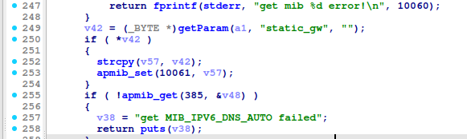
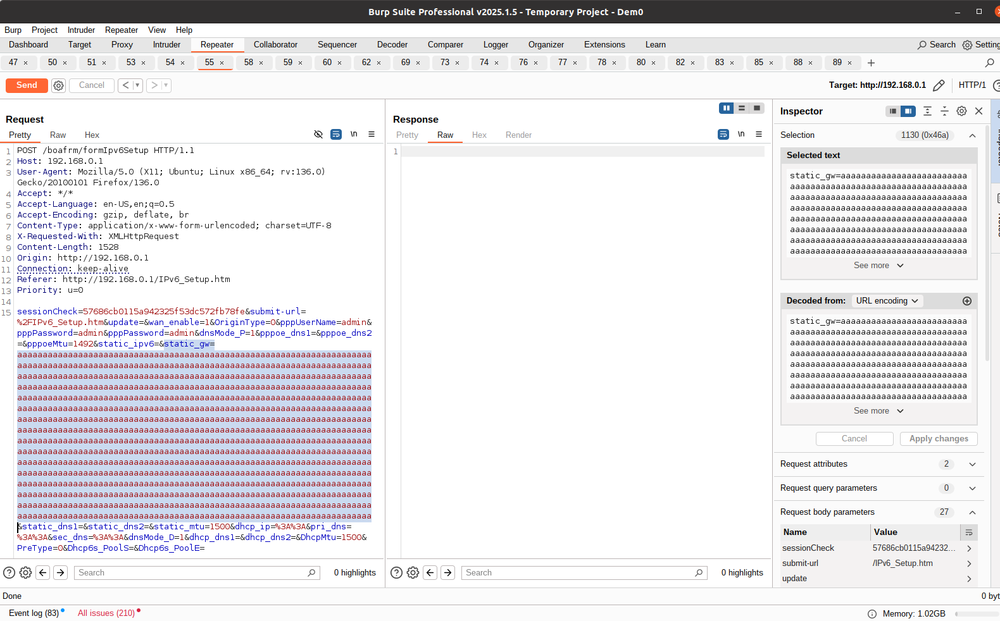
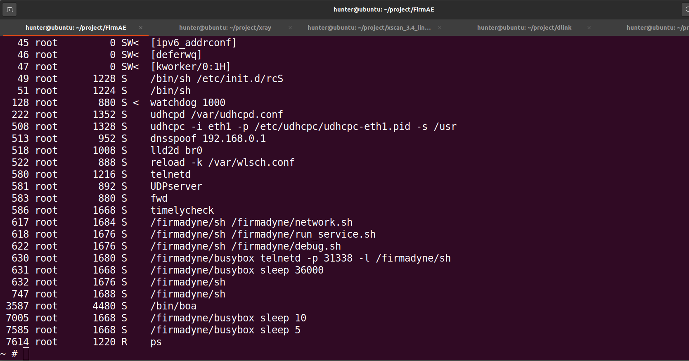
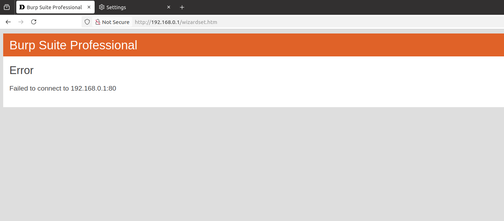

# TOTOLINK A3002RU_V2 buffer overflow Vulnerability 
## Description

TOTOLINK A3002RU V2_Firmware V2.1.1-B20230720.1011 contains a buffer overflow vulnerability in /boafrm/formIpv6Setup  `static_gw` parameter.

## TOTOLINK A3002RU_V2 version information

- Device：TOTOLINK A3002RU_V2
- Firmware Version：A3002RU V2_Firmware V2.1.1-B20230720.1011
- Manufacturer's website information：https://www.totolink.net/ 
- Firmware download address：https://www.totolink.net/home/menu/detail/menu_listtpl/download/id/181/ids/36.html

## Vulnerability information

We can see that the `v42` variable receives the `static_gw` parameter from a POST request. However, since the user can control the input of `static_gw` parameter, the statement `strcpy(v57, v42);` in line 252 can cause a buffer overflow vulnerability.

We use qemu-system to run the firmware. Then type `ps` command on the terminal of firmware. We can see boa server is alive.

We use `BurpSuite` to attck. We fill in information as shown in the figure below. And click the `Send` button. 

Once we send the post request and type `ps` command on the terminal of firmware, we can see the boa server is dead.

The browser cannot access the service.

