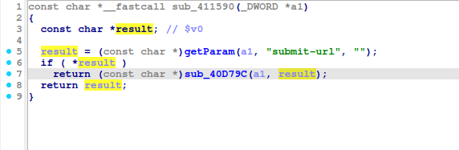
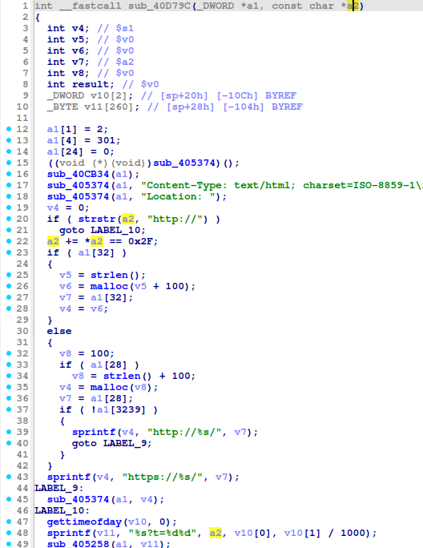
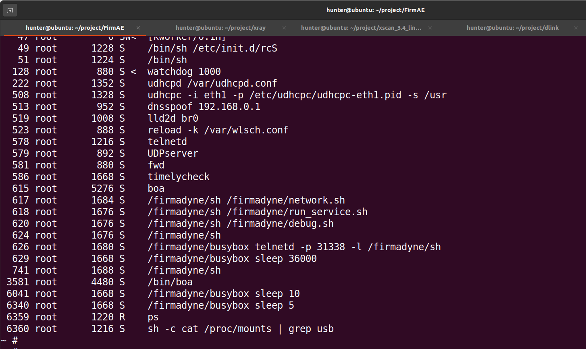
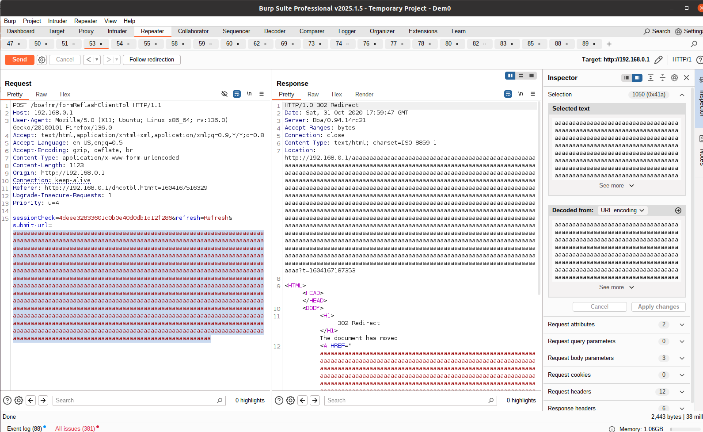
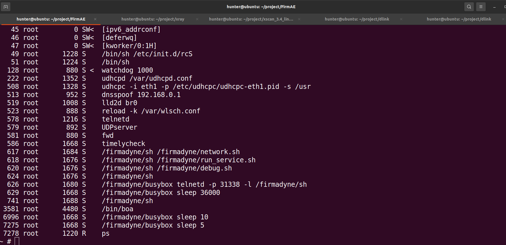
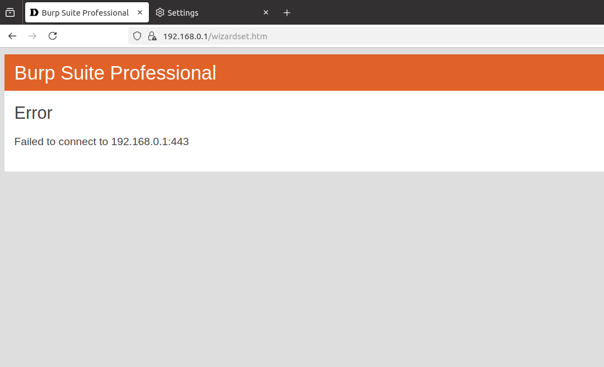

# TOTOLINK A3002RU_V2 buffer overflow Vulnerability 
## Description

TOTOLINK A3002RU V2_Firmware V2.1.1-B20230720.1011 contains a buffer overflow vulnerability in /boafrm/formReflashClientTbl  `submit-url` parameter.

## TOTOLINK A3002RU_V2 version information

- Device：TOTOLINK A3002RU_V2
- Firmware Version：A3002RU V2_Firmware V2.1.1-B20230720.1011
- Manufacturer's website information：https://www.totolink.net/ 
- Firmware download address：https://www.totolink.net/home/menu/detail/menu_listtpl/download/id/181/ids/36.html

## Vulnerability information

We can see that the `result` variable receives the `submit-url` parameter from a POST request. Then it pass `result` variable to function `sub_40D79C`.

In function `sub_40D79C`, `a2` variable receives the value of `result` variable. 

However, since the user can control the input of `submit-url` parameter, the statement `sprintf(v11, "%s?t=%d%d", a2, v10[0], v10[1]/1000);` in line 48 can cause a buffer overflow vulnerability.

We use qemu-system to run the firmware. Then type `ps` command on the terminal of firmware. We can see boa server is alive.

We use `BurpSuite` to attck. We fill in information as shown in the figure below. And click the `Send` button. 

Once we send the post request and type `ps` command on the terminal of firmware, we can see the boa server is dead.

The browser cannot access the service.

