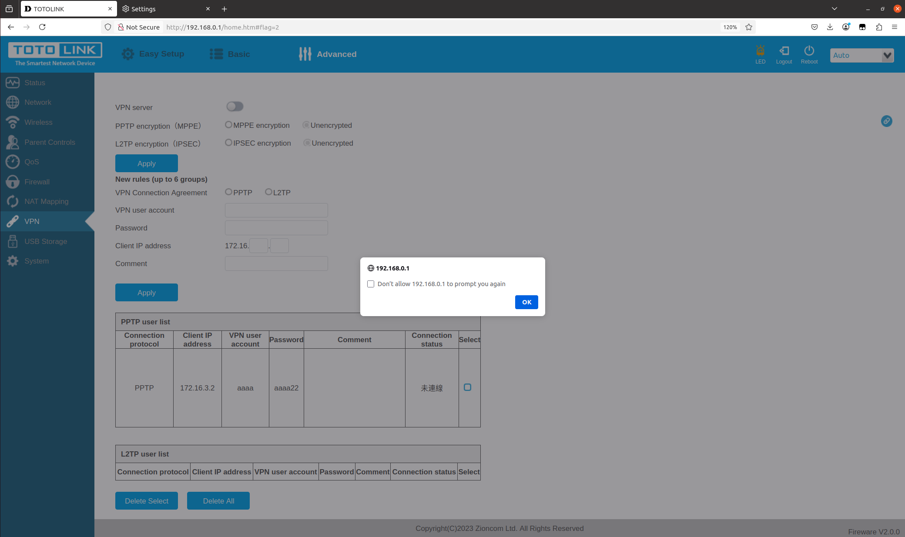

# TOTOLINK A3002RU_V2 XSS Vulnerability (VPN)
## Description

TOTOLINK A3002RU V2_Firmware V2.1.1-B20230720.1011 contains a Store Cross-site scripting (XSS) vulnerability in the `VPN` Page.

## TOTOLINK A3002RU_V2 version information

- Device：TOTOLINK A3002RU_V2
- Firmware Version：A3002RU V2_Firmware V2.1.1-B20230720.1011
- Manufacturer's website information：https://www.totolink.net/ 
- Firmware download address：https://www.totolink.net/home/menu/detail/menu_listtpl/download/id/181/ids/36.html

## Vulnerability information

In the settings under the `VPN` page, there is a Store Cross-site scripting vulnerability in `Comment` input box. We can simply input `<svg/onload=alert()>` to trigger the vulnerability.

We fill in information as shown in the figure below. Then click the `Apply` button.

After inputting the payload, the web site will execute the javascript we just inputted. This is a Store Cross-site scripting vulnerability, if someone else visits the page, the javascript will also be executed.

