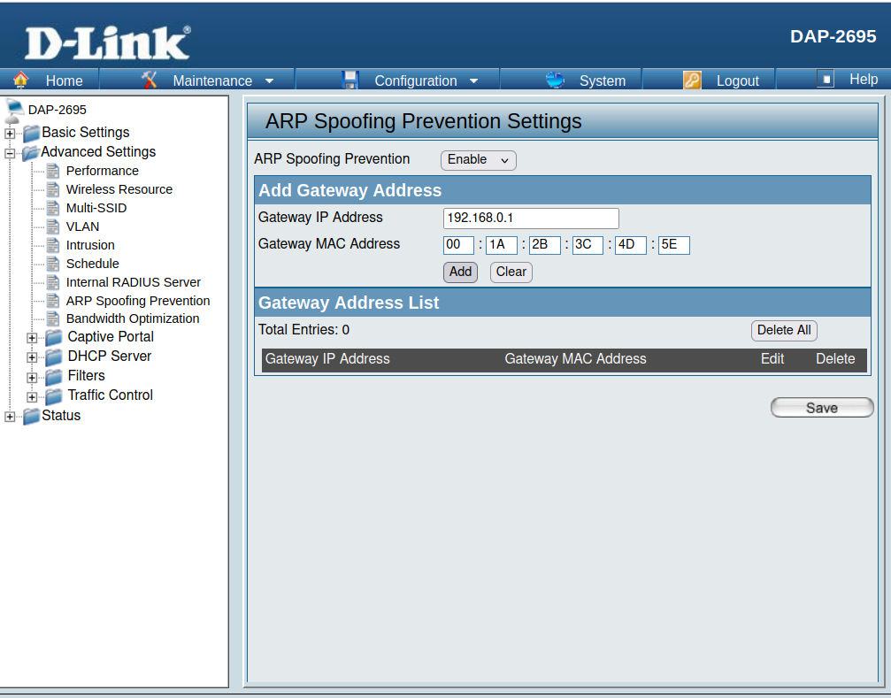
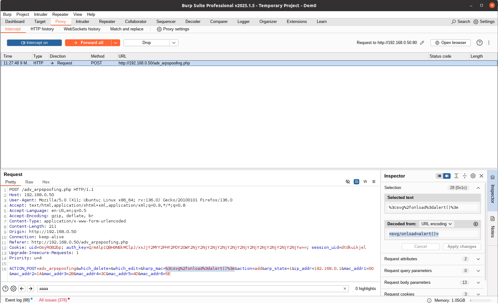
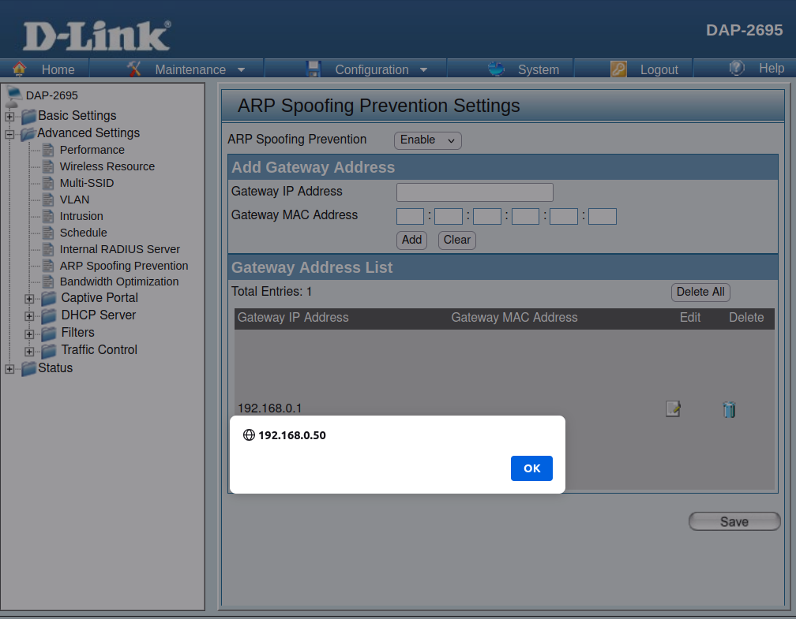

# DLINK DAP-2695 XSS Vulnerability (ARP Spoofing Prevention)
## Description

DLINK DAP-2695_fw_reva_120b36r137_ALL_en_20210528 contains a Store Cross-site scripting (XSS) vulnerability in the `ARP Spoofing Prevention` Page.

## DLINK DAP-2695 version information

- Device：DLINK DAP-2695
- Firmware Version：DAP-2695_fw_reva_120b36r137_ALL_en_20210528
- Manufacturer's website information：http://www.dlink.com.cn/
- Firmware download address：https://ftp.dlink.de/dap/dap-2695/driver_software/DAP-2695_fw_reva_120b36r137_ALL_en_20210528.zip

## Vulnerability information

In the `ARP Spoofing Prevention` page, there is a Store Cross-site scripting vulnerability in `Gateway MAC Address`. 

The `ARP Spoofing Prevention` page will check the value of `Gateway MAC Address`, but it does not check on the server, So we use BurpSuite to bypass. 

We fill in information as shown in the figure below.And Turnning on the interception function of `BurpSuite`, then click the `Add` button on the page.

Once the request is sent, `BurpSuite` will intercept the packet. We change the value of `harp_mac=` to the poc `<svg/onload=alert()>`. 

First click the `Apply changes` button on `BurpSuite`, then click `Forward all` button to send the request, and finally click `Intercept on` to turn off the interception function.

Once the request is sent, we refresh the `ARP Spoofing Prevention` page.Then the web site will execute the javascript we just inputted. This is a Store Cross-site scripting vulnerability, if someone else visits the page, the javascript will also be executed.

