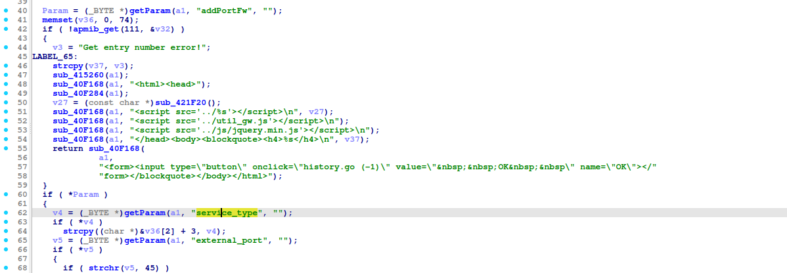
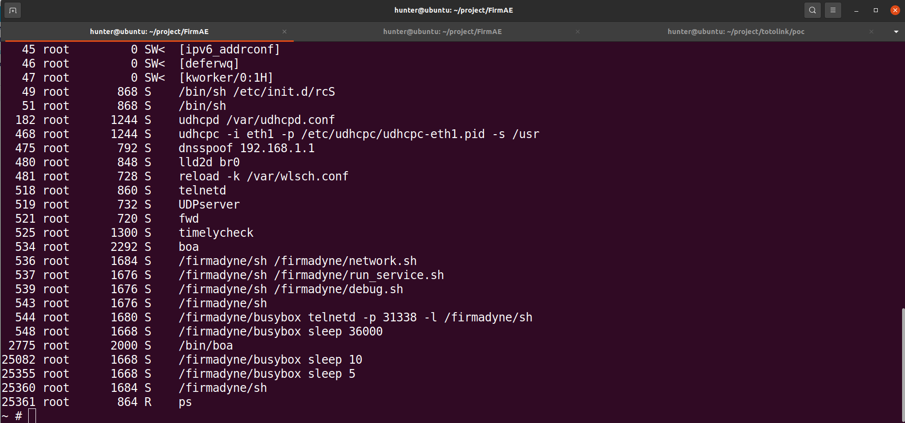
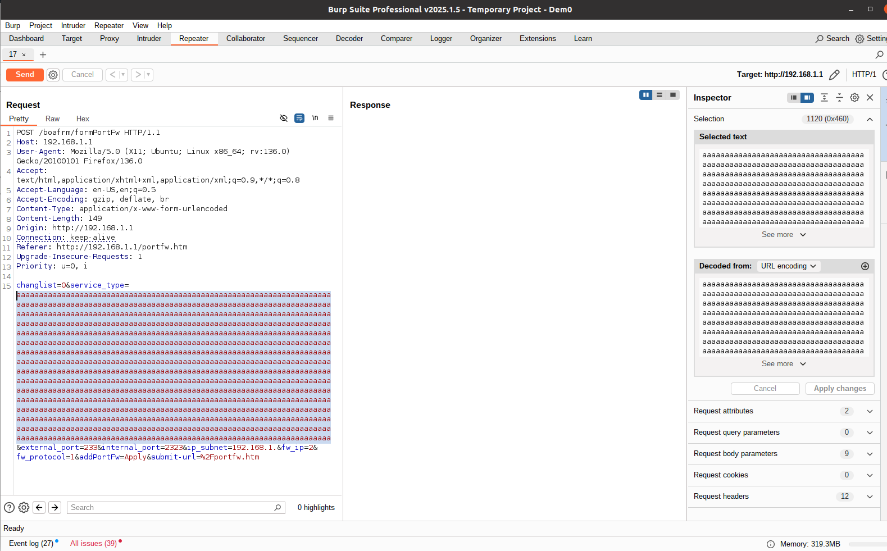
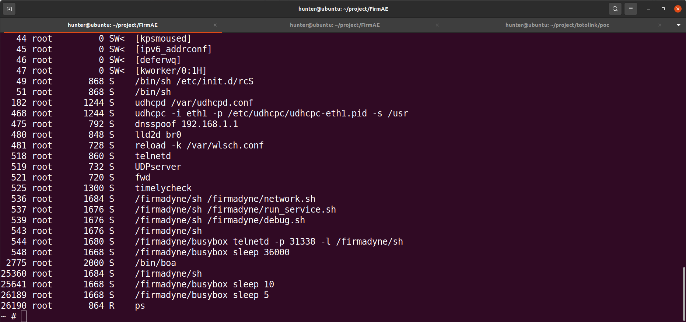
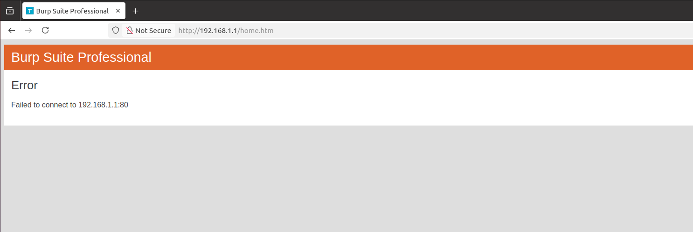

# TOTOLINK N150RT buffer overflow Vulnerability 
## Description

TOTOLINK N150RT V2_Firmware V3.4.0-B20190525 contains a buffer overflow vulnerability in /boafrm/formPortFw  `service_type` parameter.

## TOTOLINK N150RT version information

- Device：TOTOLINK N150RT
- Firmware Version：N150RT V2_Firmware V3.4.0-B20190525
- Manufacturer's website information：https://www.totolink.net/ 
- Firmware download address：https://www.totolink.net/home/menu/detail/menu_listtpl/download/id/153/ids/36.html

## Vulnerability information

We can see that the `v4` variable receives the `service_type` parameter from a POST request. However, since the user can control the input of `service_type` parameter, the statement `strcpy((char *)&v36[2] +3, v4);` can cause a buffer overflow vulnerability.

We use qemu-system to run the firmware. Then type `ps` command on the terminal of firmware. We can see boa server is alive.

We use BurpSuite to attck. We fill in information as shown in the figure below. And click the `Send` button. 

Once we send the post request and type `ps` command on the terminal of firmware, we can see the boa server is dead.

The browser cannot access the service.

