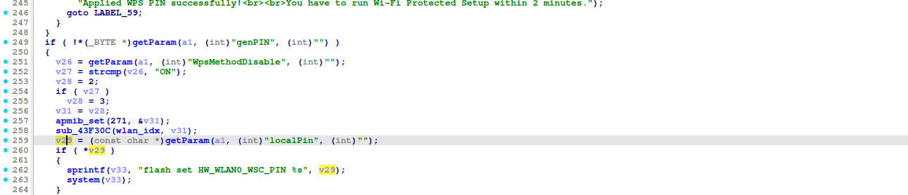
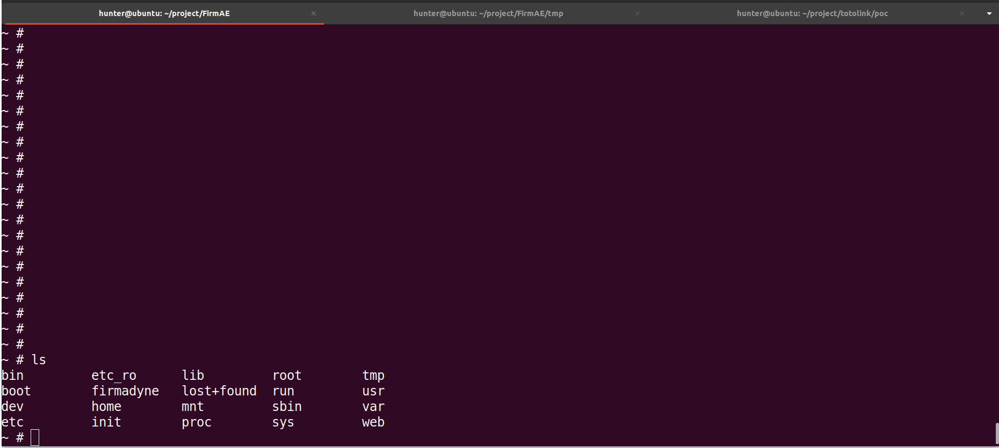
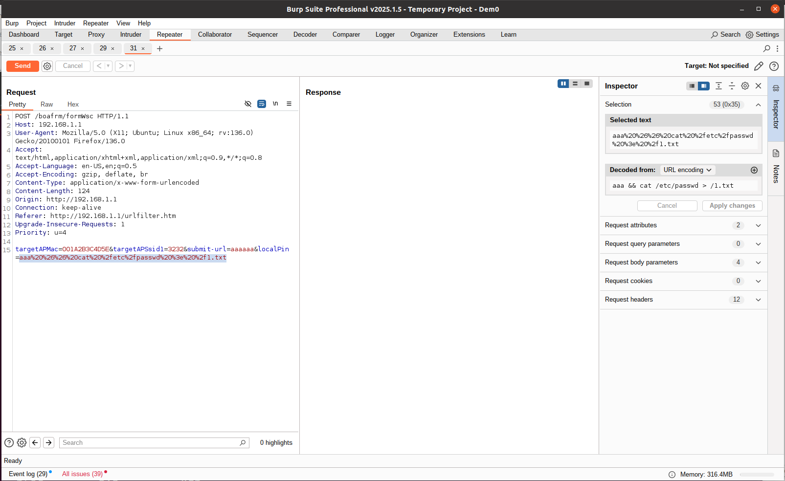
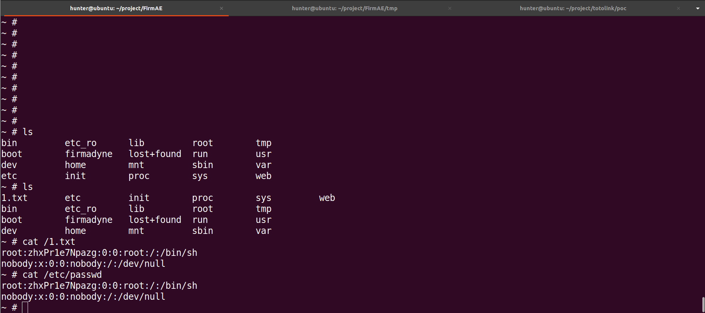

# TOTOLINK N150RT command injection Vulnerability 
## Description

TOTOLINK N150RT V2_Firmware V3.4.0-B20190525 was discovered to contain a remote code execution (RCE) vulnerability via the `localPin` parameter in the /boafrm/formWsc. 

## TOTOLINK N150RT version information

- Device：TOTOLINK N150RT
- Firmware Version：N150RT V2_Firmware V3.4.0-B20190525
- Manufacturer's website information：https://www.totolink.net/ 
- Firmware download address：https://www.totolink.net/home/menu/detail/menu_listtpl/download/id/153/ids/36.html

## Vulnerability information

We can see that the  `v29` variable receives `localPin` parameter from a POST request. However, since the user can control the input of `localPin`, the statement `system(v33);` can cause a command injection vulnerability. This vulnerability allows an attacker to execute arbitrary commands through the `localPin` parameter.

We use qemu-system to run the firmware.Then type `ls` command on the terminal of firmware.

We use BurpSuite to attck. We fill in information as shown in the figure below. And click the "Send" button. 

The purpose of `cat /etc/passwd > /1.txt`command is to output the content of file /etc/passwd to file /1.txt .

Then type `ls` , `cat /1.txt` and `cat /etc/passwd` command on the terminal of firmware. We can see the the content of file 1.txt is the same as /etc/passwd.

