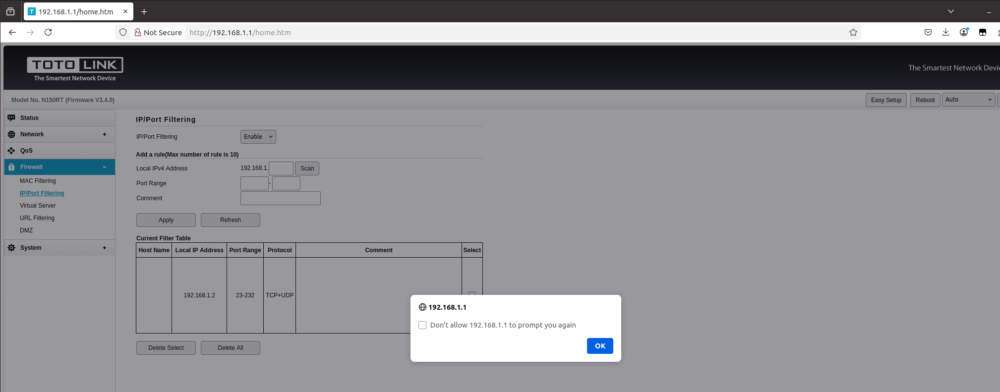

# TOTOLINK N150RT XSS Vulnerability (IP/Port Filtering)
## Description

TOTOLINK N150RT V2_Firmware V3.4.0-B20190525 contains a Store Cross-site scripting (XSS) vulnerability in `IP/Port Filtering` under the `Firewall` Page.

## TOTOLINK N150RT version information

- Device：TOTOLINK N150RT
- Firmware Version：N150RT V2_Firmware V3.4.0-B20190525
- Manufacturer's website information：https://www.totolink.net/ 
- Firmware download address：https://www.totolink.net/home/menu/detail/menu_listtpl/download/id/153/ids/36.html

## Vulnerability information

In the settings under the `Firewall` page, there is an option called `IP/Port Filtering`. 

There is a Store Cross-site scripting vulnerability in `Comment` input box. We can simply input `<svg/onload=alert()>` to trigger the vulnerability.

We choose the `Enable` and fill in information as shown in the figure below. Then click the `Apply` button.

After inputting the payload, the web site will execute the javascript we just inputted. This is a Store Cross-site scripting vulnerability, if someone else visits the page, the javascript will also be executed.

