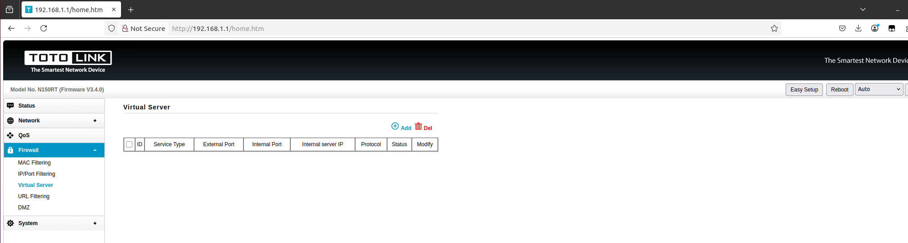

# TOTOLINK N150RT XSS Vulnerability (Virtual Server)
## Description

TOTOLINK N150RT V2_Firmware V3.4.0-B20190525 contains a Store Cross-site scripting (XSS) vulnerability in `Virtual Server` under the `Firewall` Page.

## TOTOLINK N150RT version information

- Device：TOTOLINK N150RT
- Firmware Version：N150RT V2_Firmware V3.4.0-B20190525
- Manufacturer's website information：https://www.totolink.net/ 
- Firmware download address：https://www.totolink.net/home/menu/detail/menu_listtpl/download/id/153/ids/36.html

## Vulnerability information

In the settings under the `Firewall` page, there is an option called `Virtual Server`. There is a Store Cross-site scripting vulnerability in `Service Type` input box. 

Firstly, we click the `Add` button on the `Virtual Server` page.

Then we can see the `portfw.htm` page.

The portfw.htm page will check the value of `Service Type`, but it does not check on the server, So we use BurpSuite to bypass. 

We fill in information as shown in the figure below. Then click the `Send` button to send the request.

Once the request is sent, we refresh the `Virtual Server` page.Then the web site will execute the javascript we just inputted. This is a Store Cross-site scripting vulnerability, if someone else visits the page, the javascript will also be executed.

