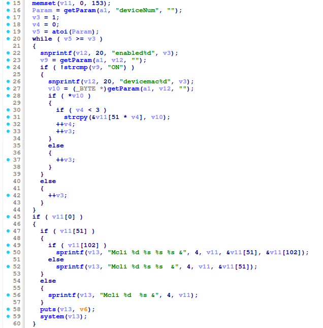
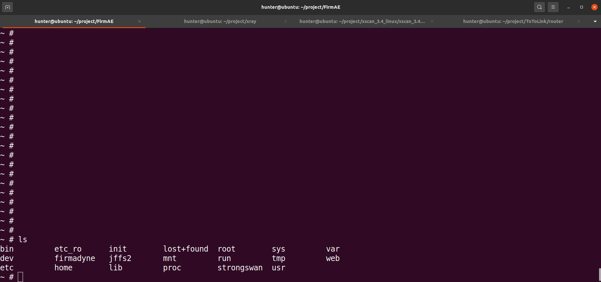
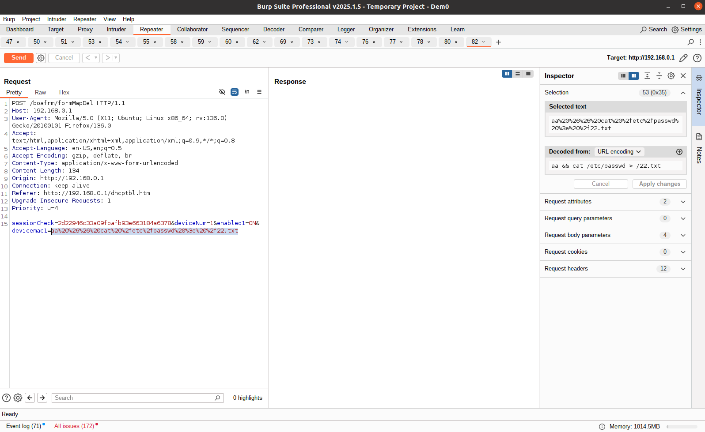
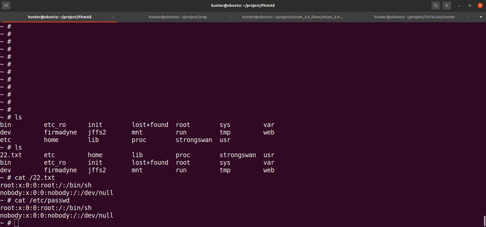

# TOTOLINK X2000R command injection Vulnerability 
## Description

TOTOLINK X2000R_Firmware V1.0.0-B20230726.1108 was discovered to contain a remote code execution (RCE) vulnerability via the `devicemac1` parameter in the /boafrm/formMapDel. 

## TOTOLINK X2000R version information

- Device：TOTOLINK X2000R
- Firmware Version：X2000R_Firmware V1.0.0-B20230726.1108
- Manufacturer's website information：https://www.totolink.net/ 
- Firmware download address：https://www.totolink.net/home/menu/detail/menu_listtpl/download/id/242/ids/36.html

## Vulnerability information

We can see that the  `v10` variable receives `devicemac1` parameter from a POST request. The statement `strcpy(&v11[51 * v4], v10);` in line 31 will pass the value of `v10` variable to `v11` variable. Then The statement `sprintf(v13, "Mcli %d %s &", 4, v11);` in line 56 will pass the value of `v11` variable to `v13` variable.However, since the user can control the input of `devicemac1`, the statement `system(v13);` in line 59 can cause a command injection vulnerability. This vulnerability allows an attacker to execute arbitrary commands through the `devicemac1` parameter.

We use qemu-system to run the firmware.Then type `ls` command on the terminal of firmware.

We use BurpSuite to attck. We fill in information as shown in the figure below. And click the "Send" button. 

The purpose of `cat /etc/passwd > /22.txt`command is to output the content of file /etc/passwd to file /22.txt .

Then type `ls` , `cat /22.txt` and `cat /etc/passwd` command on the terminal of firmware. We can see the the content of file 22.txt is the same as /etc/passwd.

