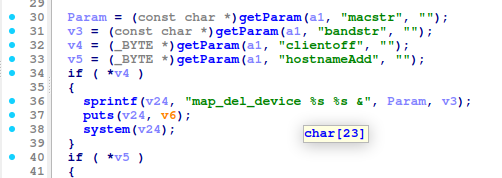
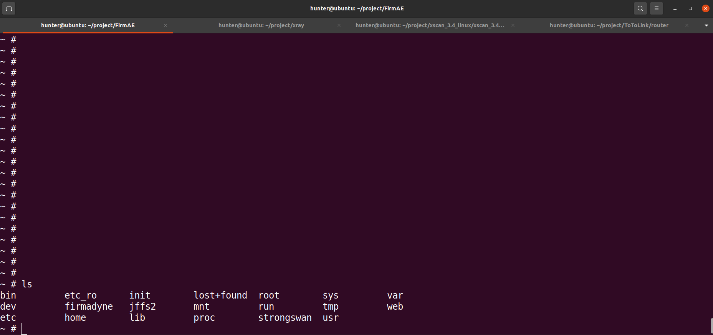
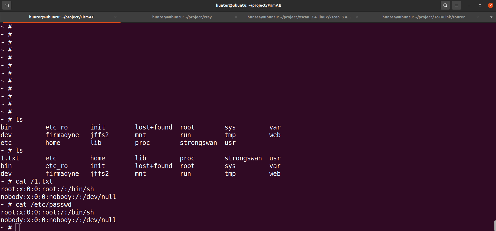

# TOTOLINK X2000R command injection Vulnerability 
## Description

TOTOLINK X2000R_Firmware V1.0.0-B20230726.1108 was discovered to contain a remote code execution (RCE) vulnerability via the `bandstr` parameter in the /boafrm/formMapDelDevice. 

## TOTOLINK X2000R version information

- Device：TOTOLINK X2000R
- Firmware Version：X2000R_Firmware V1.0.0-B20230726.1108
- Manufacturer's website information：https://www.totolink.net/ 
- Firmware download address：https://www.totolink.net/home/menu/detail/menu_listtpl/download/id/242/ids/36.html

## Vulnerability information

We can see that the  `v3` variable receives `bandstr` parameter from a POST request. Then The statement `sprintf(v24, "map_del_device %s %s &", Param, v3);` in line 36 will pass the value of `v3` variable to `v24` variable.However, since the user can control the input of `bandstr`, the statement `system(v24);` in line 38 can cause a command injection vulnerability. This vulnerability allows an attacker to execute arbitrary commands through the `bandstr` parameter.

We use qemu-system to run the firmware.Then type `ls` command on the terminal of firmware.

We use BurpSuite to attck. We fill in information as shown in the figure below. And click the "Send" button. 

The purpose of `cat /etc/passwd > /1.txt`command is to output the content of file /etc/passwd to file /1.txt .

Then type `ls` , `cat /1.txt` and `cat /etc/passwd` command on the terminal of firmware. We can see the the content of file 1.txt is the same as /etc/passwd.

