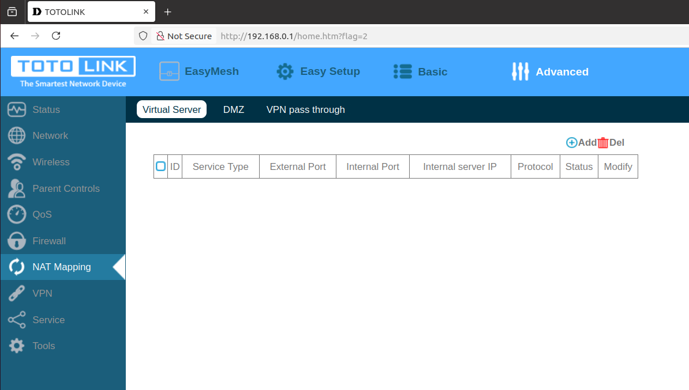
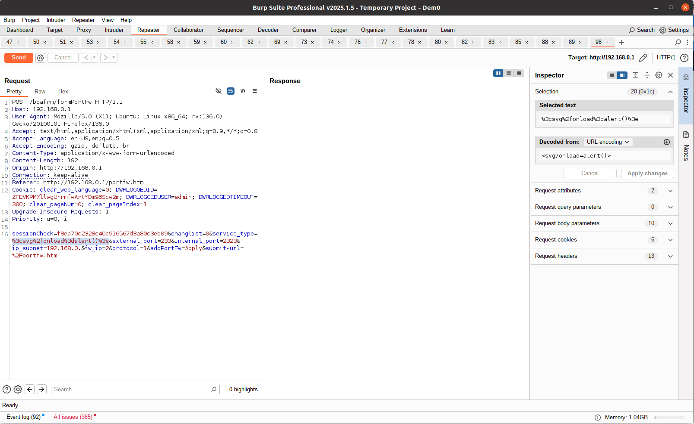
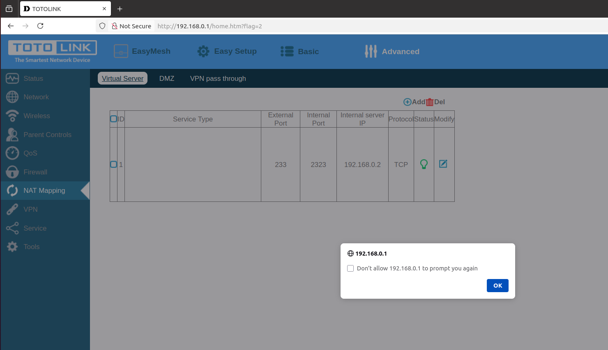

# TOTOLINK X2000R XSS Vulnerability (Virtual Server)
## Description

TOTOLINK X2000R_Firmware V1.0.0-B20230726.1108 contains a Store Cross-site scripting (XSS) vulnerability in `Virtual Server` under the `NAT Mapping` Page.

## TOTOLINK X2000R version information

- Device：TOTOLINK X2000R
- Firmware Version：X2000R_Firmware V1.0.0-B20230726.1108
- Manufacturer's website information：https://www.totolink.net/ 
- Firmware download address：https://www.totolink.net/home/menu/detail/menu_listtpl/download/id/242/ids/36.html

## Vulnerability information

In the settings under the `NAT Mapping` page, there is an option called `Virtual Server`. There is a Store Cross-site scripting vulnerability in `Service Type`  box. 

The `Virtual Server` page will check the value of `Service Type`, but it does not check on the server, So we use `BurpSuite` to bypass. 

We fill in information as shown in the figure below. Then click the `Send` button to send the request.

Once the request is sent, we refresh the `Virtual Server` page.Then the web site will execute the javascript we just inputted. This is a Store Cross-site scripting vulnerability, if someone else visits the page, the javascript will also be executed.

