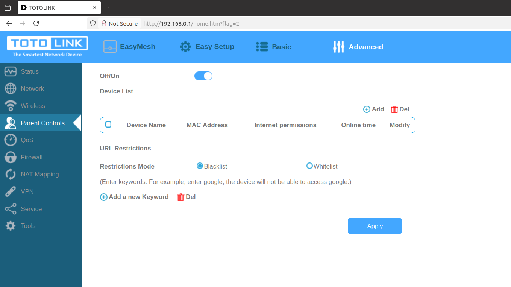
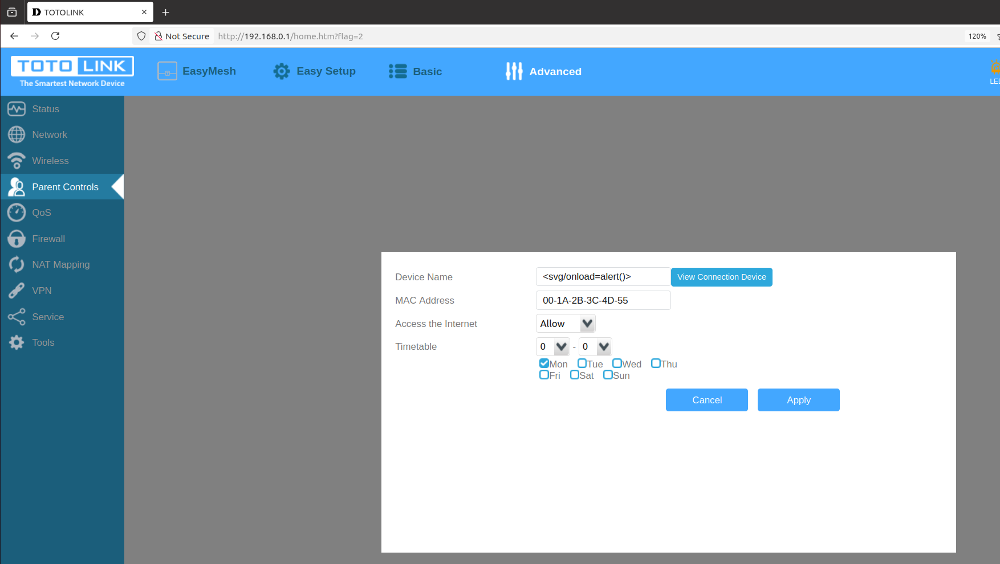
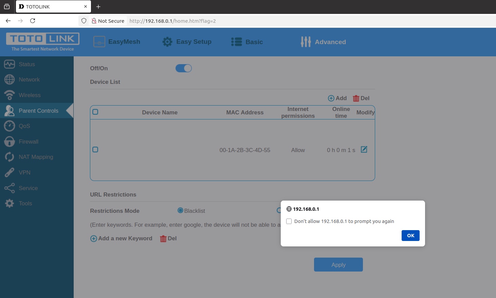

# TOTOLINK X2000R XSS Vulnerability (Parent Controls)
## Description

TOTOLINK X2000R_Firmware V1.0.0-B20230726.1108 contains a Store Cross-site scripting (XSS) vulnerability in `Parent Controls` Page.

## TOTOLINK X2000R version information

- Device：TOTOLINK X2000R
- Firmware Version：X2000R_Firmware V1.0.0-B20230726.1108
- Manufacturer's website information：https://www.totolink.net/ 
- Firmware download address：https://www.totolink.net/home/menu/detail/menu_listtpl/download/id/242/ids/36.html

## Vulnerability information

There is a Store Cross-site scripting vulnerability in `Device Name`  box. 

Firstly, we click the `Add` button on the `Parent Controls` page.

We can simply input `<svg/onload=alert()>` to trigger the vulnerability. Then click the `Apply` button.

After inputting the payload, the web site will execute the javascript we just inputted. This is a Store Cross-site scripting vulnerability, if someone else visits the page, the javascript will also be executed.

